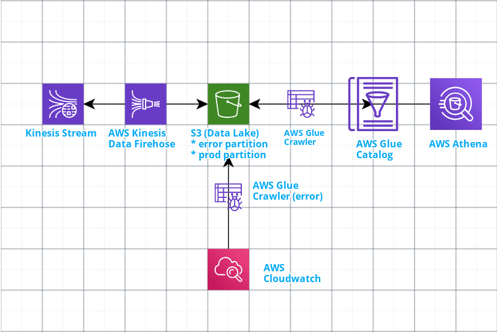
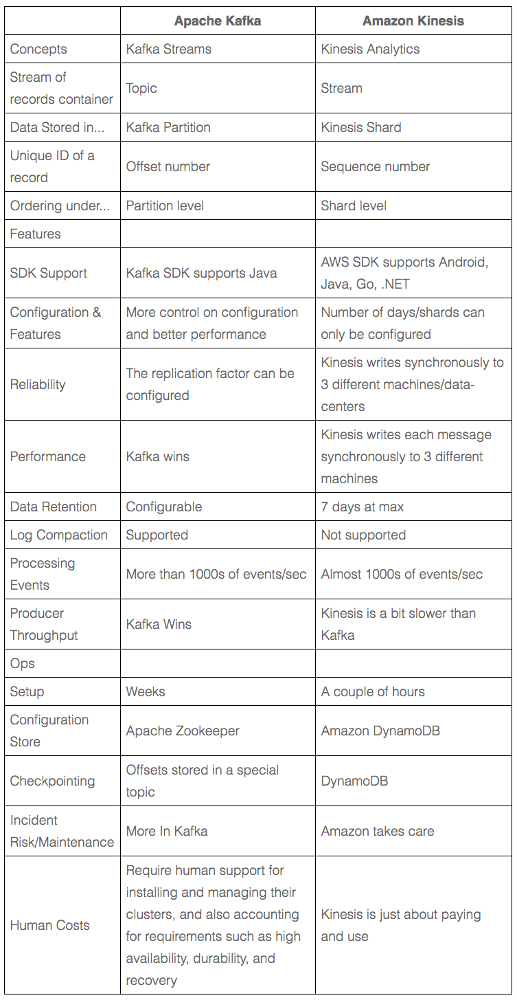
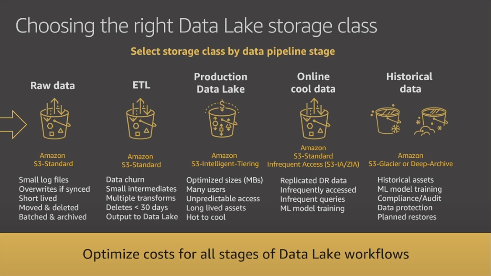
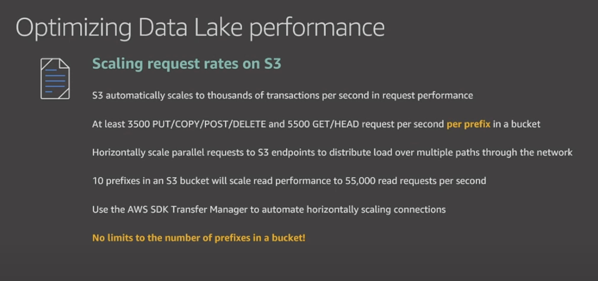
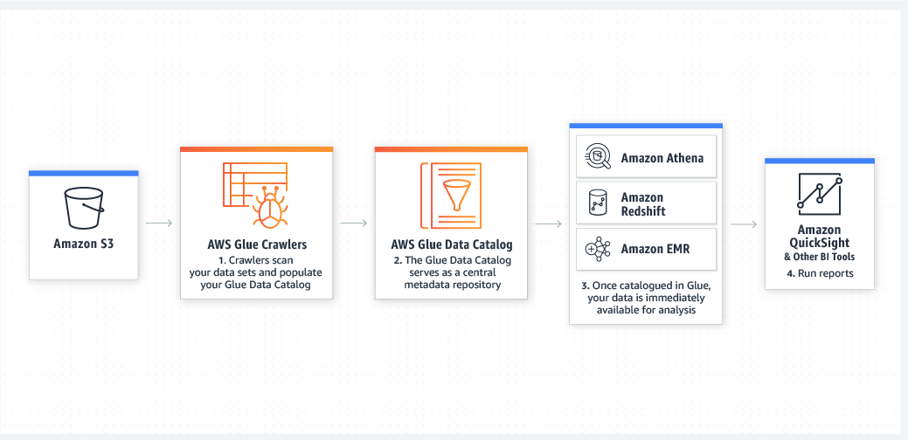

# Cloud Architecture Test

## Origin
* 1000s of events per minute
* 10s microservices emiting events to kafka

## Challenge
* Final data must be queryable
* Expected high scalability and events likely mutables (no data schema?)
* Resilient
* Data lakes as path to explore
* No need of real time data availability, different needs of availability per source of data 
* Monitoring whole process
* Cost efficient

## Architecture diagram



Premises

* S3 as a highly cost-effective storage and de facto standard for building data lakes.
* Serverless services election because on demand pricing schemas and also less maintenance hassle

## Data stream
AWS Kinesis as natural replacement for Kafka in the AWS ecosystem, even thought they are different architectures their outcome is pretty much the same.



## Amazon Kinesis Data Firehose
This is the bridge between the data stream and the permanet storage solution, S3. It consumes a data source stream and manages buffering, scaling, sharding for ingesting data to a great variaty of destinations. Fully managed service and has an on demand pricing schema. It's important to consider how partion data in S3 because it might have costs impact when using upstream services to consume it.

If any exceptions during data ingestion, firehose can be configured to deliver these errors into separate partition within the S3 bucket, that partition can be used for alternative processing methods.

## S3 buckets
De facto standard for data lakes, there is no more cheaper capacity/price relationship in any other AWS storage service, also well know for its ease-of-use features such as native encryption and access control capabilities. Bear in mind that for this design has been considered using one single bucket that might allow having data classified for different clients by using prexises, other design schemas like using different buckets per client could reach S3 limitations per aws account.

Depending of data availability needs there are different storage classes, `S3 Intelligent-Tiering` sounds like a potential solution to take advantage of tiering for one of the listed requirements.

```
Some data could be available in minutes, some other (like data needed for reports) could be available in hours.
```




## AWS Glue ETL
Used for ETL processing, there are two of these components placed in the system proof of concept

* crawler for consuming and transforming production data having an AWS Glue catalog as destination
* different crawler watching an error partition in S3 and delivering data to Cloudwatch for its analysis/monitoring

They can be triggered by events or like a chron job for populating an AWS Glue Data Catalog.

## AWS Data Catalog
Central place to have data classified/indexed for its later consumption. Bear in mind that for the nature of unstructured data it might infer schemas but the need to use schemas could be an impediment depending of more specific needs.

* How frequently data schemas change?
* What's the impact in costs and time of schema changes?

## AWS Athena
This serverless service provides easy integration to analyze data in Amazon S3 using standard SQL, its out of the box integrated with AWS Data Catalog to take advantage of querying a centralized data source. 



### Some external references

* https://www.youtube.com/watch?v=9MzaGFdPfg4
* https://medium.com/@baluVyamajala/publish-streaming-data-into-aws-s3-datalake-and-query-it-349e2a6db593
* https://www.softkraft.co/aws-kinesis-vs-kafka-comparison/
* https://docs.aws.amazon.com/glue/latest/dg/populate-data-catalog.html
* Several other AWS docs for best practices